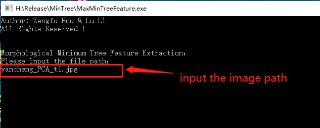

# Max-Tree-and-Min-Tree-Morphological-Feature-Extraction
This is the maximum and minimum morphological feature extraction program  for the paper nemed "Hyperspectral Change Detection Based on Multiple Morphological Profiles "

# Source
**Paper Download:**
- [https://ieeexplore.ieee.org/document/9469924](https://ieeexplore.ieee.org/document/9469924)

**Statement:**
- The morphological feature extraction in max-tree/min-tree was conducted in VISUAL STUDIO 2017 using C++ language, which provied by prof. Lu Li, and modified and encapsulated by Dr. Zengfu Hou. If you have any requirements, please contact me. <br />


**Instructions:**




# Citation
If these codes and dataset are helpful for you, please cite this paper:


**BibTex Format:**<br />
```
@ARTICLE{9469924,
author={Hou, Zengfu and Li, Wei and Li, Lu and Tao, Ran and Du, Qian},
journal={IEEE Transactions on Geoscience and Remote Sensing},
title={Hyperspectral Change Detection Based on Multiple Morphological Profiles},
year={2021},
volume={},
number={},
pages={1-12},
doi={10.1109/TGRS.2021.3090802}}
```

**Plain Text Format:**<br />
```
Z. Hou, W. Li, L. Li, R. Tao and Q. Du, "Hyperspectral Change Detection Based on Multiple Morphological Profiles," in IEEE Transactions on Geoscience and Remote Sensing, doi: 10.1109/TGRS.2021.3090802.
```

# My Website
- [Github Website](https://zephyrhours.github.io/)
- [Chinese CSDN](https://blog.csdn.net/NBDwo)
